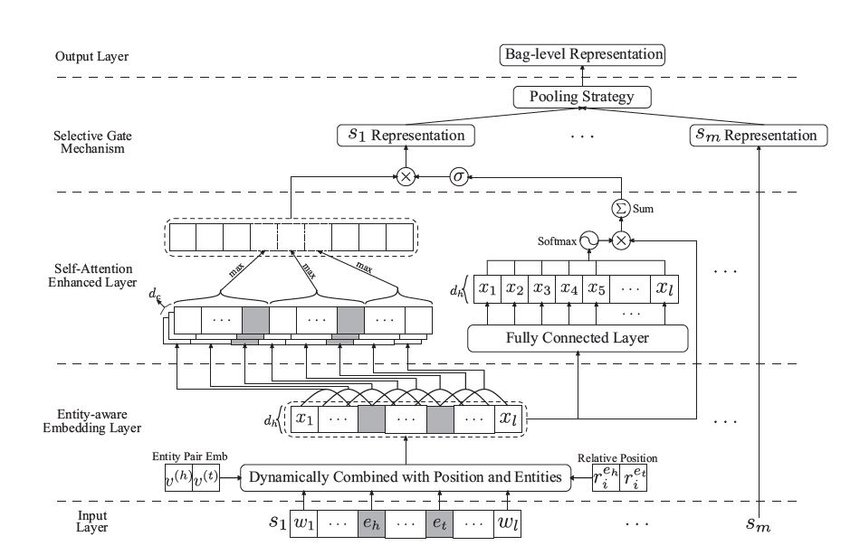

# 摘要

> 远程监督由于其强烈的假设，深受噪音数据标签的影响。
>
> 大多数现有工作都在bag级别采用选择性注意力机制来降噪。
但是其无法胜任**单句子bag**的情况。

>本文提出：
> * 提出一种实体感知词嵌入方法(**entity-aware word embedding**),来**整合位置信息和头/尾实体embedding，以突出此任务的实体本质**； 
> * 以PCNN捕获局部依存关系，并提出一种自注意力机制（**self-attention**）来捕获全局依存关系，作为PCNN的补充； 
> * 设计一个基于池的门(**pooling-equipped gate**)，来代替选择性注意力机制，该门基于上下文表示，作为聚合器生成bag级别的表示。

> 与**选择性注意力机制**相比，该门控机制的主要**优点**是，**即使bag中只有一个句子，也可以稳定执行，从而在所有训练数据中保持一致**。
>
> 在NYT 2010数据集上实验表明，该模型在AUC和top-n指标方面均达到SOTA性能。

# 拟解决的问题

* **单句子bag**在实际数据集上占比很高，并且单句子bag的标签很可能是错误的，即噪音bag；
* **单句子bag**的情况，会迫使基于选择性注意力机制的模型，返回单值标量的权重，导致注意力模块不能充分训练，从而影响性能。

# 创新点

* 使用实体嵌入(entity embedding)和相对位置嵌入(position embedding)，并**提出一种实体感知嵌入方法(entity-aware embedding approach)将实体信息动态集成到每个单词嵌入中，产生更具表达力的表示**; 
* 为增强PCNN捕获长期依赖的能力（Yu等人，2018），**开发一种轻量级的自注意机制来捕获丰富的依赖信息**，为PCNN产生互补依赖表示;
* **设计一个选择性门结构（selective gate），将句子级别表示聚合为bag级别的表示**。

# Model

(**注: 本人认为本篇论文中的公式描述和模型图片都有点错误**)

## Entity-Aware Embedding

计算过程如下：

1.首先针对bag中的每一个句子：

$s= [\omega_1,\omega_2,...,\omega_n]$, 词嵌入表示为 $X^{(\omega)} = [v_1,v_2,...,v_n] \in R^{d_\omega \times n}$

2.加入相对位置嵌入(相对距离), 位置嵌入表示为 $ r_i^{e_h} 、r_i^{e_t} \in R^{d_r}$：

$ X^{(p)} = [x_1^{(p)}, x_2^{(p)},...,x_n^{(p)}] \in R^{d_p \times n} , \forall x_i^{(p)} = [v_i; r_i^{e_h}; r_i^{e_t}], 其中d_p = d_\omega + 2 \times d_r$

3.加入实体嵌入, 头尾实体嵌入表示为$v^{(h)}、v^{(t)}$：

$X^{(e)} = [x_1^{(e)}, x_2^{(e)},...,x_n^{(e)}] \in R^{3d_\omega \times n}, \forall x_i^{(e)} = [v_i; v^{(h)};v^{(t)}] \in R^{3d_\omega}$

4.gate机制计算：

$ \alpha=sigmoid(\lambda \cdot (W^{(g1)}X^{(e)} + b^{(g1)})) \in R^{d_h \times n}, W^{(g1)} \in R^{d_h \times 3d_\omega},  \lambda是超参数$

$\tilde{X}^{(p)} = \tanh(W^{(g2)}X^{(p)} + b^{(g2)}) \in R^{d_h \times n}, W^{(g2)} \in R^{d_h \times d_p}$

$X =\alpha \cdot (W^{(X)} X^{(e)}+ b^{(X)}) + (1-\alpha) \cdot \tilde X ^{(p)} \in R^{d_h \times n}, 其中W^{(X)} \in R^{d_h \times 3d_\omega}$

得到的$X$,被认为是所有单词的entity-aware embedding。

## self-Attention Enhanced Neural Network

> 之前的一些工作（Vaswani等人，2017）发现，CNN由于缺乏衡量长期依赖的能力，即使堆叠多层，也无法在大多数NLP Benchmarks上达到SOTA性能。

### PCNN

针对每一个句子的计算公式

一维卷积操作可以表示为：

$ H^{(c)} = 1D\_CNN(X;W^{(c)}; b^{(c)}) \in R^{d_c \times n}, d_c是输出通道个数(卷积核个数)$

所得output根据头尾实体位置划分：

$H^{(c)} = [H^{(1)},H^{(2)},H^{(3)}]$

$s = \tanh([Pool(H^{(1)}); Pool(H^{(2)}); Pool(H^{(3)})]) \in R^{3d_c}$

### Self-Attention Mechanism

计算公式:

$A = W^{(\alpha2)} \sigma(W^{(\alpha1)}X + b^{(\alpha1)}) + b^{(\alpha2)}, 其中W^{(\alpha1)}、W^{(\alpha2)} \in R^{d_h \times d_h}, \sigma 是激活函数$ 

$P^{(A)} = softmax(A) \in R^{d_h \times n}$

$u = \sum P^{(A)} \odot X \in R^{d_h}$

## Selective Gate

给定一个包含m个句子的bag，通过PCNN、Self-Attention得到的句子表示为

$S = [s_1,s_2,...,s_m] \in R^{3d_c \times m}$, $U = [u_1,u_2,...,u_m] \in R^{d_h \times m}$

计算公式如下：

1.首先逐句生成gate值，该值控制该句子的表示是否应该被保留

$g_j = sigmoid(W^{(g1)} \sigma(W^{(g2)}u_j + b^{(g2)}) + b^{(g1)}) \in R^{3d_c}, \forall j=1,...,m$

$W^{(g1)} \in R^{3d_c \times d_h}, W^{(g2)} \in R^{d_h \times d_h} , \sigma(\cdot)是激活函数$

2.对PCNN的句子表示加权求和

$c = \frac 1 m \sum_{j=1}^m {g_j \cdot s_j} \in R^{3d_c}$

## Output

$p = softmax(MLP(c)) \in R^{|C|}, 其中|C|是关系种类$ 

## LOSS

L2正则化

$L_{NLL} = - \frac 1 {|D|} \sum_{k=1}^{|D|} \log p_{(y^k)}^k + \beta  || {\theta} || _2^2, 其中\theta表示模型所有参数，\beta是系数$

