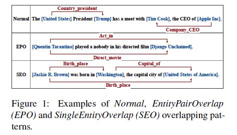
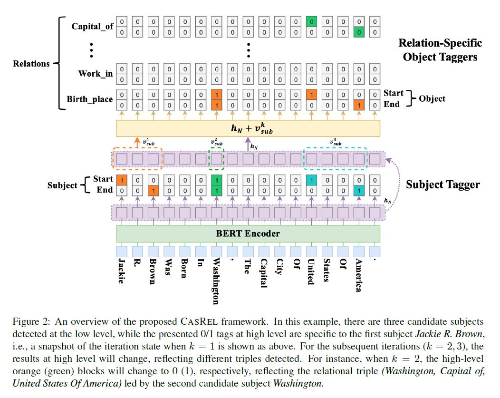

# 摘要

现有工作很少能够较好地解决关系三元组的**重叠**问题（overlapping triple problem）。 

本文用一个新的视角来重新审视关系提取任务，并提出了一种**级联二分标注框架(Cascade Binary Tagging Framework, 简称CasRel)**。

该框架将关系（relation）建模为主体（subject）与客体（object）的函数映射，而不是像以前的工作那样将关系视为离散标签。 

实验表明，该框架在多个场景下均可以获得性能提升，某些场景大幅度超越现有SOTA。

# 拟解决问题

**重叠三元组问题overlapping triple problem**有以下三种情形：

# 本文方案

## 本文关系抽取任务定义
> 本文的框架将关系（relation）建模为主体（subject）与客体（object）的函数映射，而不是像以前的工作那样将关系视为离散标签。

由学习关系分类器（relation为离散关系标签）

$f(s,o) \to r$

转变为学习**主体s在关系r下对客体o**的函数映射

$f_r(s) \to o$

>基于上述视角，关系抽取任务可以分为以下两个步骤：
> 
> * 确定句子中所有可能的主体  (subject)；
> * 针对每个主体subject，使用特定于关系的标注器（relation-specific tagger）同时识别**所有可能的关系**和**相应的客体object**

## CasRel框架（三部分）：

* **BERT-based encoder module (基于Bert的编码器模块)**

* **subject tagging module(主体标注模块)**

* **relation-specific object tagging module(区分关系的客体标注模块)**

## 训练目标

针对训练集 $D$ 中的句子$x_j$，给定对应的潜在overlap triples集合 $ T_j = \{(s,r,o)\} $，最大化数据似然估计：

$ \prod\limits_{j=1}^{|D|} {\left[ \prod\limits_{(s,r,o) \in T_j} {p((s,r,o)|x_j)}\right]} $

$ = \prod\limits_{j=1}^{|D|} {\left[ \prod\limits_{s \in T_j} p(s|x_j) \prod\limits_{(r,o) \in T_j|s} p((r,o)|s,x_j)\right]}$

$ = \prod\limits_{j=1}^{|D|} {\left[ \prod\limits_{s \in T_j} p(s|x_j) \prod\limits_{ r \in T_j|s} p_r(o|s,x_j) \prod\limits_{r \in R \backslash T_j|s} p_r(o_{\emptyset}|s,x_j)\right]}$

其中，$s \in T_j$ 表示出现在 $T_j$ 中三元组的主体（subject），

$T_j | s $ 表示 $T_j$ 中主体是 $s$ 的三元组集合，

$R$ 是所有可能的**关系**的集合，

$\backslash$ 表示集合的差集,

$o_\emptyset$ 表示"null"客体。

> 对于任一个给定的主体 s , 在"s确实参与表达的关系r"的作用下，必定可以映射为客体 o ,而对于其他关系，映射为"空"客体 $null$

## BERT Encoder

编码器使用Bert 

## Subject Tagger

训练两个二元分类器，分别识别Subject的**开始位置**和**结束位置**,标识为1, 其他标识为0

对于每一个起始位置，从该位置依次向后**寻找最近的结束位置**, 从而寻找出所有Subject

$p_i^{start\_s} = \sigma (W_{start} X_i + b_{start})$,

$p_i^{end\_s} = \sigma (W_{end} X_i + b_{end})$,

$ X_i $ 表示序列第i个词的bert编码，

$\sigma $ 表示sigmoid激活函数。

### loss

最大化似然函数：
$p_\theta(s|X) = \prod\limits_{t \in \{start\_s,end\_s\}} {\prod\limits_{i=1}^L (p_i^t)^{I\{y_i^t = 1\} }(1-p_i^t)^{I\{y_i^t = 0\}}}$,

$L$是句子长度，

$I\{z\} = 1$ ，如果 z 为 true， 否则 0，

$\theta$ 是参数集合

> 经过这一步骤，可是识别出句子中**所有Subject**

## Relation-specific Object Taggers

针对每一个关系 $r$,训练两个二元分类器，分别识别**针对关系r映射出的Object**的**开始位置**和**结束位置**，标识为1， 否则标识为0

$p_i^{start\_o} = \sigma (W_{start}^r (X_i + V^k_{sub}) + b_{start}^r)$,

$p_i^{end\_o} = \sigma (W_{end}^r (X_i + V^k_{sub}) + b_{end}^r)$,

$V_{sub}^k$ 表示subject tagger识别出的**第k个Subject的编码**，若为多个词构成，取均值

### loss

最大化似然函数：

$p_{\emptyset_r}(o|s, X) = \prod\limits_{t \in \{start\_o,end\_o\}} {\prod\limits_{i=1}^L (p_i^t)^{I\{y_i^t = 1\} }(1-p_i^t)^{I\{y_i^t = 0\}}}$,

$L$是句子长度，

$I\{z\} = 1$ ，如果 z 为 true， 否则 0，

$\emptyset_r$ 是参数集合,

另外，“空”客体Object，意味着 
$$y_i^{start\_o_{\emptyset}} = y_i^{end\_o_{\emptyset}} = 0 $$

> 针对**Subject Tagger**识别出的每一个Subject，计算该subject在**每个关系作用下的Object**。
> 对于每一个关系 $r$
> 若得到非空Object，既可以抽取出关系三元组，
> 若得到空Object，则认为不存在该关系。

## 整体Loss

最大化似然函数：

$J(\Theta) = \sum\limits _{j=1} ^ {|D|} \left[ {\sum\limits _{s \in T_j} \log p_\theta(s|X_j)} + {\sum\limits _{r \in T_j|s} \log p_{\emptyset_r}(o|s,X_j)} + {\sum\limits _{r \in R \backslash T_j|s} \log p_{\emptyset_r}(o_\emptyset|s,X_j)}  \right]$

