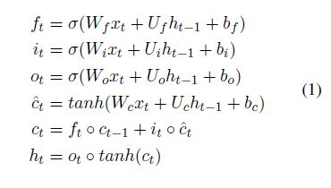

# 摘要

本文研究了关系抽取(Re)的任务，目的是识别文本中提到的两个实体之间的语义关系。 在Re的深度学习模型中，**整合输入句子的依存树中的句法结构是有益的**。 
在这种模型中，依赖树经常被用来**直接构造网络结构**或**获得单词对之间的依赖关系，以此通过多任务学习将句法信息注入模型中**。

这些方法的主要问题是**训练数据中缺乏超越句法结构的泛化**，或者**未能捕捉词对于RE的句法重要性**。

为了克服这些问题，我们提出了一种新的Re深度学习模型，该模型**使用依赖树提取单词的基于句法的重要性得分，作为树的向量表示，以将句法信息注入具有更大泛化性的模型中**。 

特别是，我们利用**有序神经元长短期记忆网络**(ON-LSTM)来推断句子中**每个单词的基于模型的重要性得分**，然后对其进行调整，使其与基于句法的分数保持一致，从而实现句法信息注入。 

我们进行了广泛的实验来证明所提出的方法的有效性，从而在三个基准数据集上取得了SOTA性能。

# 引言

最近对RE的研究集中在深度学习上，以开发从文本数据中自动生成句子向量表示的方法。在这些最近的研究中，值得注意的是，**输入句子的句法树（即依存树）可以为深度学习模型提供有效的信息，从而得到SOTA性能**

特别是，以前的RE深度学习模型大多都利用句法树中呈现的单词连接来构造网络结构(例如，依存树上的图卷积神经网络(GCN))。不幸的是，这些模型由于**训练数据的树结构可能与测试数据中的树结构有很大的不同**而导致泛化性较差，即模型过拟合于训练数据的句法树结构。这一问题在跨领域RE时，尤为明显。

为克服这一问题，总体策略是**获得更一般的句法树向量表示**，这些嵌入向量可用来将句法信息注入到深度学习模型中，以获得更好的泛化效果。

2019年 Veyseh等人给出了RE的一般树表示，其中依存树被分解为句子中单词之间的依赖关系集（即边)，称为基于边的表示。然后，在多任务学习框架中使用这些依赖关系，来同时预测两个实体间的关系和输入句子中单词对之间的依赖关系。

**基于边的表示**的**主要缺点**是它只捕获单词之间的成对（局部）连接，而完全忽略了单词在句子中对RE问题的整体（全局）重要性，特别是，在RE的关系预测过程中，给定句子中的某些单词可能比其他单词包含更有用的信息，并且这个句子的依存树可以帮助更好地识别那些重要的单词，并为它们分配更高的重要性得分（**即在两个实体之间沿最短依赖路径选择单词**）

在本文中，我们提出从依存树中获得句子中每个单词的重要性得分（称为基于句法的重要性得分 syntax-based importance scores），这将作为依存树的一般向量表示，以将句法信息注入RE深度学习模型中。

如何在RE深度学习模型中使用基于句法的重要性得分？

* 首先，利用深度学习模型中的单词向量表示（词嵌入可能参与训练）为每个单词计算一个重要性得分（称为model-based importance scores）
* 利用KL散度使上述两个重要性得分的分布一致，使这个重要性得分能够反映句法信息

为了实现上述想法，本文首次采用了ON-LSTM(Ordered-Neuron Long Short-Term Momory Networks)计算单词的model-based importance scores。

ON-LSTM相较于LSTM新填了2个门（gate）结构：

* master forget
* master input

ON-LSTM局限：

>  master gates 和 model-based importance scores 仅依赖于当前词本身及其左上下文（先前时刻隐状态）

> 为了更有效利用整个句子的信息，本文提出**先生成整个句子的向量表示，并把其作为每个单词计算其重要性得分的输入**

为了进一步改善深度学习模型的编码能力，以学习到更好的特征向量，本文引入一种新的**归纳偏置**：

> 使 基于**两个实体间的最短依赖路径**的特征向量 和 基于**整个句子**的特征向量 的相似度尽可能高

该归纳偏置基于以下直觉：句子中两个实体的语义关系可以从整个句子或者最短依赖路径中推断出来。

# 模型

本文模型主要分为三大组件：

* CEON-LSTM （context-enriched ON-LSTM）
	* 用于计算model-based importance scores
* syntax-model consistency component
	* 促使syntax-based与model-based重要性得分分布一致
* Sentence-Dependency Path Similarity
	* *基于句子整体的特征向量*和*基于最短依存路径的特征向量*的相似度组件

## 嵌入层

三部分的拼接：

* 预训练词嵌入（pre-trained word embedding）
* 基于相对距离的位置嵌入（position embedding）
	* t-s、t-o
* BIO实体标注嵌入（entity type embedding）

## CEON-LSTM

### LSTM

公式如下：

计算流程图如下：

### ON-LSTM

> 为了将依存树中的句法结构融合进LSTM，引入两个门（gate）：master forget($\tilde{f_t}$)、 master input($\tilde{i_t}$)

首先定义累加函数
$$cumsum([x_1,x_2,...,x_n]) = [x_1, x_1+x_2, x_1+x_2+x_3,..., x_1+x_2+...+x_n]$$

定义数值软化函数 $cummax(X) = cumsum(softmax(X))$

具体计算公式如下：

$$ \tilde{f_t} = cummax(W_{\tilde{f_t}}x_t+U_{\tilde{f_t}}h_{t-1}+b_{\tilde{f_t}}) $$

$$ \tilde{i_t} = 1-cummax(W_{\tilde{i_t}}x_t+U_{\tilde{i_t}}h_{t-1}+b_{\tilde{i_t}}) $$

$$\omega_t=\tilde{f_t} \circ \tilde{i_t} (按位相乘，表示重叠交汇部分)$$

$$ c_t = \omega_t \circ (f_t \circ c_{t-1}+ i_t \circ \hat{c_t}) + (\tilde{f_t}-\omega_t) \circ c_{t-1} + (\tilde{i_t}-\omega_t) \circ \hat{c_t} $$

整体计算流程如下：

$\tilde{f_t}$和$\tilde{i_t}$的输出分别从0递增到1、从1递减至0，且都可以分为两个段（近0段、近1段），其中近1段可以理解为当前时间步处于活跃状态的cell states中的神经元/维度。详见[2](http://hanrd.tech/posts/20200830a/)

因此，本文利用近1段，即**处于活跃态的维度的个数**计算model-based scores。

master forget的值：

$$ \tilde{f_t} = \tilde{f_{t1}},\tilde{f_{t2}},...,\tilde{f_{tD}} $$

model-based score：

$$ mod_t = 1 - \sum \nolimits_{i = 1..D} \tilde{f_{ti}} $$

### CEON-LSTM

> ON-LSTM引入句子上下文信息

用下述$x'_t$代替mater gates计算中的$x_t$

$$ x = x_1, x_2,..., x_N $$

$$ x'_t = \sum \nolimits_i \alpha_{ti} (W_x x_i + b_x) $$

$$ \alpha_{ti} = \frac{ \exp ((W_h h_{t-1} + b_h) \bullet (W_x x_i + b_x))} { \sum \limits _{j = 1} ^N \exp ((W_h h_{t-1} + b_h) \bullet (W_x x_j + b_x)) } $$

## Syntax-Model Consistency

首先，计算syntax-based importance score ($syn_t$)：

1. 计算依存树最短依赖路径 $DP$ (词序列)
2. 计算依存树任意词对间最长路径长度 $T$
3. $ syn_t = T - minLength(w_t, DP) $  ,
其中$minLength(w_t, DP)$表示计算$w_t$与最短依存路径$DP$上某一单词在依存树上的路径长度的最短长度

> 经过上述计算，位于最短依存路径DP上的单词的重要性得分均为T, 而其他单词，距离DP越远得分越低。

> 该syntax-based score可以看作是原始依存树的泛化（relaxd）版，可以避免模型对训练数据语法结构的**过拟合**

Syntax-Model Consistency的思路可以理解为：
> 利用syntax-based score为model-based score提供监督信号，通过KL散度定义loss

计算公式如下：

$$ \overline{mod}_1, \overline{mod}_2, ..., \overline{mod}_N = softmax(mod_1, mod_2,...,mod_N) $$

$$ \overline{syn}_1, \overline{syn}_2, ..., \overline{syn}_N = softmax(syn_1, syn_2,...,syn_N) $$

$$L_{importance} = - \sum \nolimits_i \overline{mod}_i \log \frac {\overline{mod}_i} {\overline{syn}_i}$$

## Sentence-Dependency Path Similarity

> 最大化**基于句子整体的特征向量**和**基于最短依存路径的特征向量**的相似度

* 首先划定两个单词的序列：整个句子词序列、最短依存路径词序列
* max-pooling模型CEON-LSTM的隐状态序列$h = h_1,h_2,...,h_N$的上述单词序列对应的隐状态序列

首先计算句子$X$和最短依存路径$DP$的特征向量表示$R_X$、$R_{DP}$

$$R_X = MaxPooling_{x_i \in X}(h_i)$$

$$R_{DP} = MaxPooling_{x_i \in DP}(h_i)$$

定义损失函数：

$$L_{path} = 1 - \cos (R_X, R_{DP}) ,其中\cos表示余弦相似度$$

## Output & Loss

用于RE预测的全部特征向量为：
$$ V = [x_s, x_o, h_s, h_o, R_X], s和o为主客两个实体的索引$$

$$ output= P(.| X, x_s, x_o) = softmax(W_{output} V + b_{output})$$

$$L_{label} = - \log P(r|X, x_s, x_o), r是最适关系标签,即真实标签$$

损失函数定义：
$$ L = L_{label} + \alpha L_{importance} + \beta L_{path} $$

# 参考链接

[[1].Exploiting the Syntax-Model Consistency for Neural Relation Extraction](https://www.aclweb.org/anthology/2020.acl-main.715/)

[[2].ORDERED NEURONS:INTEGRATING TREE STRUCTURES INTO RECURRENT NEURAL NETWORKS](http://hanrd.tech/posts/20200830a/)

