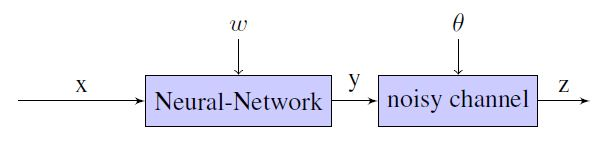

# 摘要

本文拟解决基于 "带有不可靠标签的数据" 训练神经网络的问题。

> 基于假设**观察到的标签是真实标签的带噪观测结果**，从而引入一个额外的噪音层，模拟噪音分布对真实标签的影响。

* 提出一种同时学习**神经网络参数**和**噪声分布**的方法
* 在几个标准分类任务上的对比实验说明了该方法对性能的提升。
* 在某些情况下，即使“人工手动标注并假定没有错误的数据”，该方法也有所帮助。

# 模型

> 假设在训练过程中不能直接观察到正确标签y，只能观察到带噪标签z

噪音分布可以看作关系标签间的转移概率 

$\theta (i,j) = p(z=j|y=i) $

观测的带噪标签 z 的概率：

$ p(z=j|x;\omega, \theta) = \sum\limits_{i=1}^k p(z=j|y=i; \theta) p(y=i|x;\omega), $

$\omega是参数集合, x是输入特征（可以是句子、手工创建的特征等）, k是关系的个数$

模型结构图如下：

对于输入特征 $x$ , 编码后的特征向量表示为 $h = h(x)$,

$p(y=i|x;\omega) = \frac {\exp(u_i^\top h)}{\sum\limits_{j=1}^k \exp(u_j^\top h)}, i=1,2,...,k$ 

$u$ 是参数

## 训练阶段

> 给定 n 个输入特征 $x_1,...,x_n$, 相对应的观测带噪标签 $z_1,..., z_n$ , 真实标签 $y_1,...,y_n$

对数极大似然估计：

$L(\omega, \theta) = \sum\limits_{t=1}^n \log (\sum\limits_{i=1}^k p(z_t|y_t=i;\theta) p(y_t=i|x_t;\omega))$

目标是：最大化该似然函数，找出参数 $\omega$ 、噪音分布 $\theta$

由于

## 
Improving Long-Tail Relation Extraction with Collaborating Relation-Augmented Attention

