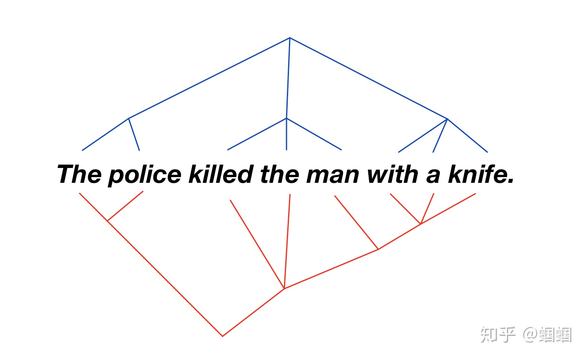
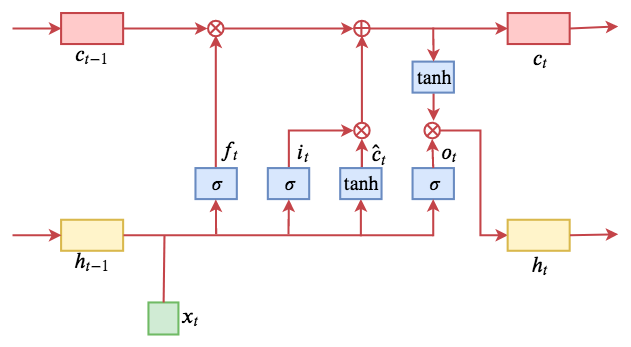
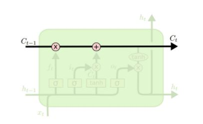
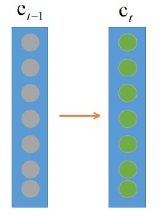
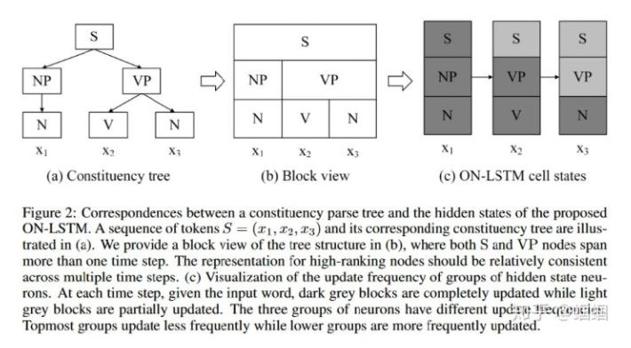
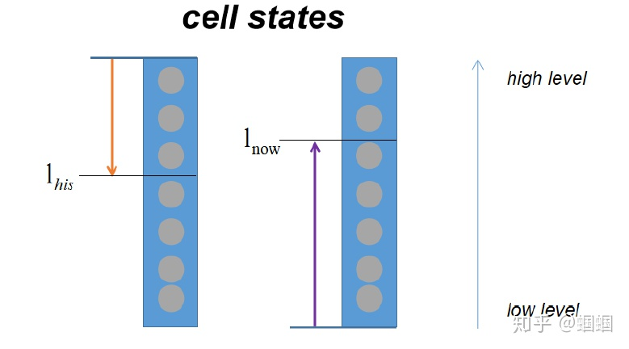
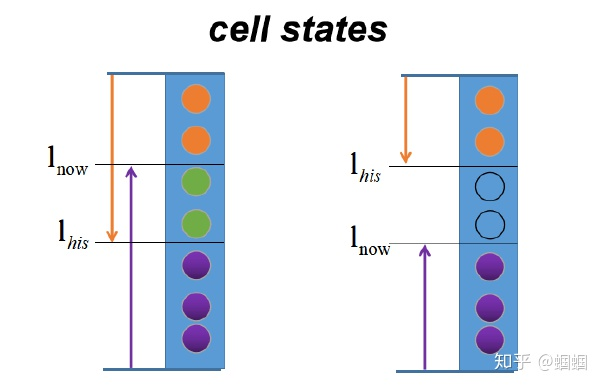
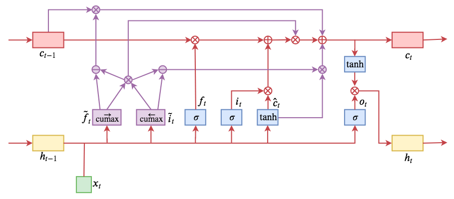

# 拟解决问题

语言虽然看起来是一个序列，实际上内部是有复杂的层次结构的，这也是NLP的难点所在。复杂的层次结构，意味着序列即使看起来相同，也可能因为内部层次结构的不同而有语义的差别。

在斯坦福CS224n上提到了这样的一个例子：

> The police killed the man with a knife.

这个句子，可以有两种理解：

* 警察把那个带刀的人干掉了
* 警察用刀干掉了那个人

上面两种解释对应的句法树分别是这样的：

> 序列看起来一样，但是由于内部的层级结构不一样会导致不同的语义理解

当用LSTM为语言序列编码Encode的时候，由于LSTM单纯认为语言是一个序列，忽略了语言内部的语法树的层级结构，因此其无法解决上面**相同序列，不同语义**的问题。

# 出发点
本文提出ON-LSTM(Ordered Neurons - LSTM)，通过重新设计LSTM递归的cell的**cell states的更新方式及策略**，实现将语法树的层级结构融合进LSTM编码器中，解决上述问题。

# 回顾LSTM

LSTM主要由三个特殊的门（gate）结构组成：遗忘门、输入门、输出门

具体的公式如下：

示意图如下：

# ON-LSTM

## 从LSTM开始

论文中一直是从神经元排序的角度解释的，对我个人来说，很难理解，故下文按照cell state的角度理解。

LSTM的**核心**就是**cell state**：信息在cell state这个传送带上流动，伴随着一些简单的线性变换，乘和加，分别由“遗忘门”和“输入门”来控制cell state的信息更新。

这样存在一个问题：
**每次更新，cell state这个向量的每一维都会更新**

信息流就是存在于这个cell state中，如果希望模型可以刻画出语言的结构信息，也就意味着这个cell state中要隐含着层次结构的信息。

所以作者希望，能够让这个cell state的不同维度，对应到语言的不同层级上，让不同的层级使用不一样的方式进行更新，具体来说就是层次越高的更新越少。这样的话，cell state就包含了层次信息了。

**作者的例子：**

假设我们有一个很简单的句子，三个词组成[x1,x2,x3]，有三个层次，用下图的最左边的图表示，分别是句子（S）、短语（NP，VP）、词（N，V）。**我们希望cell state中也可以有对应的三个层次，层次就体现在不同的更新频率上。**

层次越高的，自然其信息应该保留的时间更久，所以其更新频率应该越低。上图的最右边是三个词分别对应的cell states。颜色越深代表更新频率越高。

* 当读到第一个词x1的时候，这个时候是new S，new NP，new word，所以三个层次都应该更新；
* 当读到第二个词x2的时候，这个时候是new VP，new word，所以下面两个层次应该更新；
* 当读到第三个词x3的时候，这个时候只是new word，所以只是最下面的层次应该更新；
这样，语言的层次就和cell states的不同区间对应上的。

> 这样，就相当于给**cell states**加了一个顺序，从某种意义上讲也相当于是给LSTM的神经元加了顺序，因此作者称这种结构是**Ordered-Neurons**，对应的LSTM称为**ON-LSTM**。所以并不是真的给神经元排序。

接下来的问题：

上面给cell states这样分区间，是因为我们提前知道了句子的结构，但我们真正使用LSTM进行建模、训练的时候，是不知道语言的真实层次的，除非你先把每个句子都解析成语法树，再显式加入到LSTM中的，但是这种方法不仅开销大，而且不一定可靠，所以我们**需要设计一种结构，让模型可以学习到如何给cell state去分区**。

## ON-LSTM具体设计

为了实现区间的划分，模型用到了两个整数 $l_{his}$ 和 $l_{now}$，它们分别用来表示**历史信息的最低等级** 和 **当前信息的最高等级**

* $l_{his}$表示cell state中高于该等级的维度需要保留历史信息$c_{t-1}$，对应于**低更新频率**
* $l_{now}$表示cell state中低于该等级的维度需要补充更新输入信息$\hat{c_t}$，对应于**高更新频率**

总体上，就包含以下两种情况：

* $l_{his} < l_{now}$ ,有重叠交汇部分：
	* **交汇部分**，采用原来LSTM更新方式，融合历史信息和当前输入信息
	* **低于$l_{his}$的**，完全更新为新输入的信息
	* **高于$l_{now}$的**，完全保留历史信息

* $l_{his} > l_{now}$ ,无重叠交汇部分：
	* **无交汇部分**，全部设置为0
	* **低于$l_{now}$的**，完全更新为新输入的信息
	* **高于$l_{his}$的**，完全保留历史信息

> 其实该模型认为高层次的语法信息主要是来自于历史信息，而低层次的主要来自当前输入信息，而这也比较符合人们的直观印象，对于一个新的输入，它对于语法信息的影响往往局限于一个较低的层次，高层次的信息（如句子或者短语信息）仍然来自于历史信息，只有当一个句子或者短语完结的时候，历史信息的影响变小，这时新的输入才有可能影响较高语法层次的信息。而这样也就使得高语法层次的信息的更新频率较低，大多时候是保持不变，而低语法层次的信息则随着当前的输入一直变化。

## ON-LSTM实现过程

把$l_{his}、 l_{now}$转化为向量
$$L_k = [0,0,...,1,0,...,0] ,其中只有第k位为1$$

定义累加函数
$$cumsum([x_1,x_2,...,x_n]) = [x_1, x_1+x_2, x_1+x_2+x_3,..., x_1+x_2+...+x_n]$$

因此，
* $cumsum(L_{l_{his}})=[0,...,0,1,1,...,1]$就表示出了需要保留历史信息的维度（1段）
* $1-cumsum(L_{l_{now}})=[1,...,1,0,0,...,0]$就表示出了需要更新保存新输入信息的维度（1段）

由于，上面这种分为0段和1段的形式，都是整数，这样函数不可导，无法训练，所以需要做一下软化，即用softmax函数处理一下。

定义 $cummax(X) = cumsum(softmax(X))$

综上，引入两个门（gate）结构：master forget（$\tilde{f_t}$）、master input（$\tilde{i_t}$）。

具体计算公式如下：

$$ \tilde{f_t} = cummax(W_{\tilde{f_t}}x_t+U_{\tilde{f_t}}h_{t-1}+b_{\tilde{f_t}}) $$

$$ \tilde{i_t} = 1-cummax(W_{\tilde{i_t}}x_t+U_{\tilde{i_t}}h_{t-1}+b_{\tilde{i_t}}) $$

$$\omega_t=\tilde{f_t} \circ \tilde{i_t} (按位相乘，表示重叠交汇部分)$$

$$ c_t = \omega_t \circ (f_t \circ c_{t-1}+ i_t \circ \hat{c_t}) + (\tilde{f_t}-\omega_t) \circ c_{t-1} + (\tilde{i_t}-\omega_t) \circ \hat{c_t} $$

整体计算流程如下：

> 通常隐层神经元的数目都比较大，而实际中语法的层数远远达不到这个数字，因此对于$\tilde{f_t}$和$\tilde{i_t}$而言，其实不需要那么多的维数，这样会导致需要学习的参数量过多，但是 $\circ$ 要求它们的维数必须这么大，因此我们可以构造一个维数为$D_m = D / c$ 的向量，其中D为隐层神经元的维数，然后在将其扩充为D维向量，例如D=6，c=3，先构造一个向量[0.2, 0.8] ，然后将其扩充为 [0.2, 0.2, 0.2, 0.8, 0.8, 0.8] 。

# 总结

该ON-LSTM模型从语法结构的角度出发，根据语法层次对cell states进行有序排列，再按照语法层次的不同实行不同的更新规则，从而实现对于较高语法层次信息的保留，这样对于语言模型等任务无疑是很有利的。另外，利用该模型还能够较好地从句子中无监督地提取出语法结构，而这也是该模型的一大亮点。

# 参考资料

[1] [ORDERED NEURONS: INTEGRATING TREE STRUCTURES INTO RECURRENT NEURAL NETWORKS](https://arxiv.org/abs/1810.09536)

[2] [苏剑林. (2019, May 28). ON-LSTM：用有序神经元表达层次结构 [Blog post].](https://kexue.fm/archives/6621) 

[3] [有序的神经元——ON-LSTM模型浅析](https://zhuanlan.zhihu.com/p/77086523)

[4] [ON-LSTM：能表示语言层次的LSTM](https://zhuanlan.zhihu.com/p/69314959)
